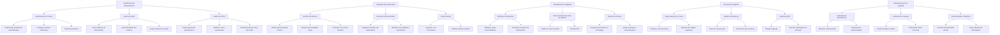

```mermaid
graph TD;
A[Identificação da Obsolescência] --> B[Monitoramento Contínuo];
    A --> C[Coleta de Dados];
    A --> D[Análise de Risco];
    B --> E[Implementar ferramentas automatizadas];
    B --> F[Configurar alertas e notificações];
    B --> G[Revisões periódicas];
    C --> H[Gerar relatórios de desempenho];
    C --> I[Coletar feedback dos usuários];
    C --> J[Analisar dados de mercado];
    D --> K[Avaliar impacto da obsolescência];
    D --> L[Identificar riscos operacionais];
    D --> M[Determinar tempo crítico para ação];


 N[Avaliação da Solução Atual] --> O[Auditoria de Sistema];
    N --> P[Reuniões de Stakeholders];
    N --> Q[Benchmarking];
    O --> R[Verificar documentação técnica];
    O --> S[Revisar funcionalidades atuais];
    O --> T[Comparar com outras soluções];
    P --> U[Organizar reuniões com stakeholders];
    P --> V[Identificar necessidades e expectativas];
    Q --> W[Comparar com concorrentes];
    Q --> X[Analisar melhores práticas];

 Y[Planejamento do Upgrade] --> Z[Definição de Requisitos];
    Y --> AA[Desenvolvimento de Caso de Negócio];
    Y --> AB[Seleção de Solução];
    Z --> AC[Identificar novas funcionalidades];
    Z --> AD[Considerar requisitos de desempenho];
    AA --> AE[Análise de custo-benefício];
    AA --> AF[Calcular ROI];
    AB --> AG[Pesquisar fornecedores e tecnologias];
    AB --> AH[Avaliar propostas e demonstrações];

    AI[Execução do Upgrade] --> AJ[Desenvolvimento e Testes];
    AI --> AK[Gestão de Mudanças];
    AI --> AL[Implementação];
    AJ --> AM[Planejar e executar testes];
    AJ --> AN[Revisões de código e segurança];
    AK --> AO[Plano de comunicação];
    AK --> AP[Treinamento para usuários];
    AL --> AQ[Planejar migração];
    AL --> AR[Executar implantação em produção];

    AS[Monitoramento Pós-Upgrade] --> AT[Verificação de Desempenho];
    AS --> AU[Feedback dos Usuários];
    AS --> AV[Documentação e Relatórios];
    AT --> AW[Monitorar continuamente];
    AT --> AX[Revisões pós-implementação];
    AU --> AY[Coletar feedback contínuo];
    AU --> AZ[Implementar ações corretivas];
    AV --> BA[Atualizar documentação técnica];
    AV --> BB[Gerar relatórios de desempenho];
```
